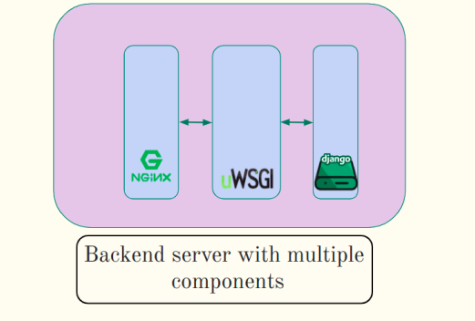
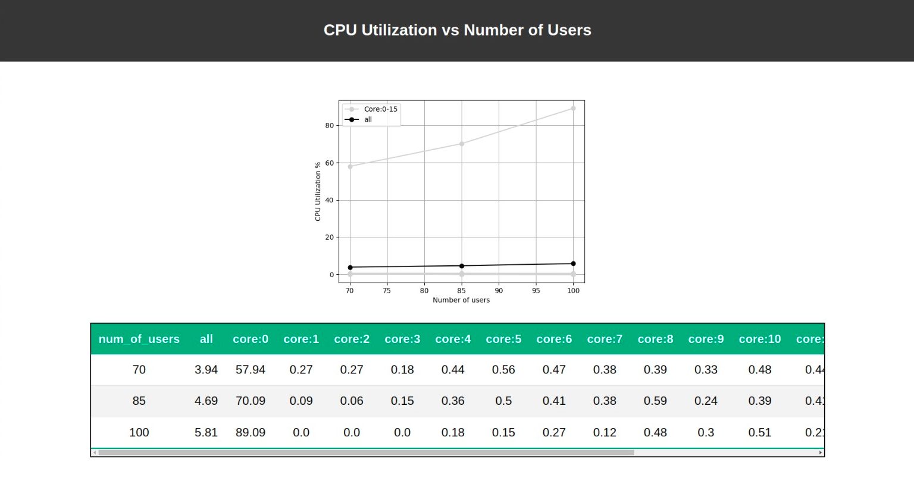

# sys_perf_check_tool
## Description
* Modern web apps are composed of a frontend and a backend
* The backend is often composed of multiple components
* It is possible that you might have a component in backend that is choking the system at a certain load
* sys_perf_check helps us detect such a component
* e.g. of a such a system is shown below

* the tool itself is composed of two components the client_end_script and server_end_script
* for a brief idea of sys_perf_check refer this [link](resources/brief.pptx) and for a detailed one refer this [link](resources/detailed.pptx)

## Initial Setup
### Configuring hosts and ports

* the config.py file in client_end_script
```
TEST_SERVER_HOST="https://safev2.cse.iitb.ac.in/" # host which will point to the backend app 
LOG_HOST="10.129.7.11" # host where logs will be collected
CPU_HOST ="10.129.7.11" # host where the application is running

# the below ones should only be configured in case ports are not available
# match with the config.py file in server_end_script
SERVER_DAEMON_PORT=5000
FTP_SERVER_PORT=5001
HTTP_PORT=5002 
RESULT_PORT = 5500
# this should be configured in case more log lines need to searched for each component
SEARCH_LINES_LIMIT=200000
```

* the config.py file in server_end_script
```
# same as client_end_script
SERVER_DAEMON_PORT=5000
FTP_SERVER_PORT=5001
HTTP_PORT=5002
```

### components.json
* Need to define a components.json file that will be used by both the client_end_script and server_end_script
* e.g. of the components.json is shown below
```
[
    {
        "componentName":"outer-nginx",
        "logPath":"/var/log/nginx/safev2.cse-proxy-access.log",
        "timeUnit":"s"
    },
    {
        "componentName":"uwsgi",
        "logPath":"/home/safev2admin/kashmira/safe_server_v2/logs/uwsgi/uwsgi-daemonize.log",
        "timeUnit":"ms"
    }

]
```

### Registering sys_perf_check endpoint
* make sure to register the below code as an api end point in your web application at path: <host_name>/sys_perf_check/<num_users>
* e.g for python shown below
```
# a loop that uses cpu for 10 ms
def sys_perf_check_end_point(request,test_id,numuser):
    y=0
    x=timeit.default_timer()
    while((timeit.default_timer()-x)<0.01):
        y=y+1
    z=timeit.default_timer()
    res=(z-x)*1000
    return HttpResponse("the time taken to execute the test "+test_id+" for id is "+str(res)+" miliseconds for the number of user "+numuser)
```

## Running the tool
### Start the server_end_script
* install twisted module (using pip)
* install htop on the machine for cpu utilization

```
# requires a components.json file
# run the below script on the server where you are hosting your project and want to measure its performance
$ python3 server_end_script.py
```

### Running the cliend_end_script
* install docker if not present
#### Build the docker container
```
$ docker build -t <image_name>
```

#### Run the script using the docker container
```
$ docker run --rm -p <result_port>:5500 -v $(pwd):/app <image_name> python3 client_end_script.py -l <start_load> -u <end_load> -s <step_size> -t <duration>
```

### Results
* they will be available at <result_port> and can be seen in the browser
* e.g. image of result shown below


